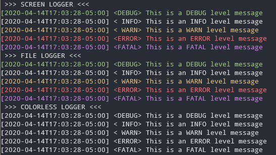

# go-colorlog
This is a simple logger that has colorized messages for screen prints and the ability to log to a file.

## Getting Started
### Install
`$ go get github.com/macdub/go-colorlog`

### Example Code
```go
package main

import (
    "fmt"
    "github.com/macdub/go-colorlog"
)

func main() {
    // Init a new screen logger
    fmt.Println(" >>> SCREEN LOGGER <<<")
    screenLogger := colorlog.New(colorlog.Ldebug)
    screenLogger.Debug("This is a DEBUG level message\n")
    screenLogger.Info("This is an INFO level message\n")
    screenLogger.Warn("This is a WARN level message\n")
    screenLogger.Error("This is an ERROR level message\n")
    screenLogger.Fatal("This is a FATAL level message\n")


    // Init a new file logger
    fmt.Println(" >>> FILE LOGGER <<<")
    fileLogger := colorlog.NewFileLog(colorlog.Ldebug, "test.log")
    fileLogger.Debug("This is a DEBUG level message\n")
    fileLogger.Info("This is an INFO level message\n")
    fileLogger.Warn("This is a WARN level message\n")
    fileLogger.Error("This is an ERROR level message\n")
    fileLogger.Fatal("This is a FATAL level message\n")
    fileLogger.Close()

    // Init a new colorless logger
    fmt.Println(" >>> COLORLESS LOGGER <<<")
    colorlessLogger := colorlog.NewColorless(colorlog.Ldebug)
    screenLogger.Debug("This is a DEBUG level message\n")
    screenLogger.Info("This is an INFO level message\n")
    screenLogger.Warn("This is a WARN level message\n")
    screenLogger.Error("This is an ERROR level message\n")
    screenLogger.Fatal("This is a FATAL level message\n")
}
```


The test.log file will contain the same messages printed to the screen without the color tags.

## Available Data
### Logging Levels
```
colorlog.Lnone      - Silence all logging
colorlog.Ldebug     - Log Debug messages
colorlog.Linfo      - Log Info messages
colorlog.Lwarn      - Log Warning messages
colorlog.Lerror     - Log Error messages
colorlog.Lfatal     - Log Fatal messages
```
### Colors
These are the alias for the ANSI color codes
```
colorlog.Black
colorlog.Red
colorlog.Green
colorlog.Yellow
colorlog.Blue
colorlog.Magenta
colorlog.Cyan
colorlog.Grey
colorlog.White
```

### Structs and Type Alias
```go
type ColorLog struct {
    screenFormat string
    fileFormat   string
    LogLevel     LogLevelEnum
    logFile      *os.File
    logWriter    *bufio.Writer
    isFileLogger bool
    noColor      bool
}

type LogLevelEnum int
type ColorEnum int
```
### Avaliable Methods
Create a new screen logger:
`func New(level LogLevelEnum) *ColorLog`

Create a new colorless screen logger:
`func NewColorless(level LogLevelEnum) *ColorLog`

Create a new file logger:
`func NewFileLog(level LogLevelEnum, filename string) *ColorLog`

### ColorLog Methods
Methods available to the ColorLog:
- basic logging functions (Debug, Info, Warn, Error, Fatal) take in a format string and options like fmt.Printf
```
// print debug message
func (l *ColorLog) Debug(msg string, opts ...)

// print info message
func (l *ColorLog) Info(msg string, opts ...)

// print warning message
func (l *ColorLog) Warn(msg string, opts ...)

// print error message
func (l *ColorLog) Error(msg string, opts ...)

// print fatal error message
func (l *ColorLog) Fatal(msg string, opts ...)

// print using the logging format to screen
func (l *ColorLog) Print(level LogLevelEnum, color ColorEnum, msg string, opts ...)

// print a colorized message to screen
func (l *ColorLog) Printc(msg string, level LogLevelEnum, color ColorEnum)

// write message to log file
func (l *ColorLog) Write(msg string, level LogLevelEnum)

// close the log file
func (l *ColorLog) Close()

// get a timestamp in RFC3339 format
func (l *ColorLog) TimeStamp() string

// set a new logging level
func (l *ColorLog) SetLogLevel(level LogLevelEnum)
```

## To Do
- ~~Make the logging calls be able to take in a format string and parameters~~ Done
- ~~Implement a colorless option~~ Done
- Add in a quiet log level. To allow for the option to squelch some info level logging.
